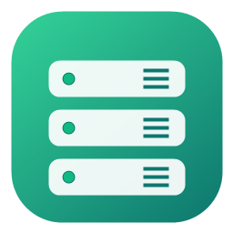
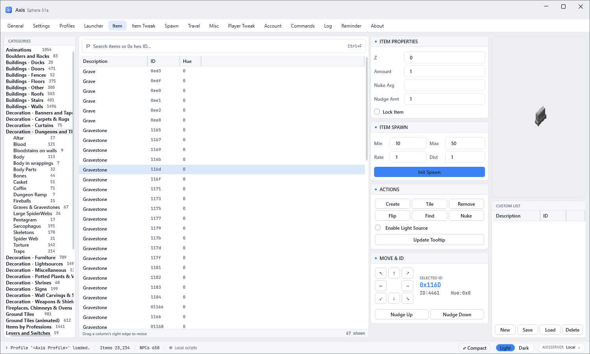
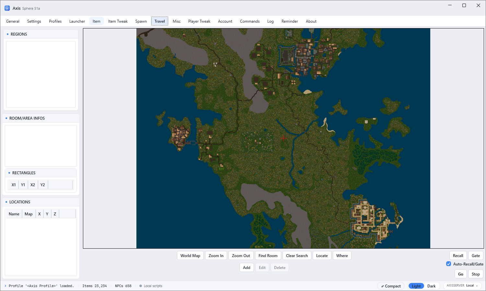

<p align="center">
  
  &nbsp;&nbsp;&nbsp;
  
</p>

<h1 align="center">Axis2 — Sphere 51a Toolkit</h1>

<p align="center">GM/admin tool for Sphere 0.51a shards, with an optional data server.<br/>
Инструмент GM/админа для шардов Sphere 0.51a, с опциональным сервером данных.</p>

---

## Screenshots

**Item** — browse every item in your shard's scripts by category (with counts), live-search by name or
hex ID, preview the tile art in its real hue, and place / move / spawn it in the client.
*Просмотр всех предметов шарда по категориям, живой поиск, превью тайла в реальном цвете, установка/спавн.*



**Travel** — the shard's world map rendered from the `.mul` files, with regions/rooms, saved locations,
and recall / gate tools to jump anywhere.
*Карта мира шарда из `.mul`, регионы/комнаты, сохранённые локации и recall/gate для перемещения.*



---

## English

**Axis2** loads your shard's items, NPCs, regions and spells and lets a GM work with them and send
commands to a running UO client (FWUO / Orion / ClassicUO). Data comes either from **local scripts**
or from the bundled **AxisServer** over the network (a "Web Profile").

### Download & run
Grab the binaries from **Releases** (`Package/`):
* `Axis2/Axis2.exe` — the tool. **Run as administrator** (required to send commands to the client).
* `AxisServer/AxisServer.exe` — the data server (optional, for Web Profiles).

### Client settings (in the app)
Open the **Settings** tab:
* **Command Prefix** — your shard's command prefix.
* **UO Title** — part of your client window's title (used to find the client).
* **File Paths** — point these at your UO client's `.mul`/`.uop` files (art, hues, maps, sounds).

Then open **Profiles**, create a profile:
* **Local** — pick the folder with your `.scp` scripts and the scripts to load.
* **Web** — enter the AxisServer URL + your Sphere account login/password.

### Server settings (`AxisServer/axisserver.ini`)
Plain text — edit and restart the server:
```ini
Url          = http://0.0.0.0:5099          # address to listen on
BaseDirectory = D:\YourShard\...            # folder with your scripts
ItemFiles    = sphereitem.scp, sphereitem2.scp
CharFiles    = spherechar.scp
MapFiles     = spheremap.scp, spheremap2.scp, spheremap3.scp
AccountFile  = accounts\sphereaccu.scp      # for login
MinPlevel    = 2                            # only PLEVEL 2+ (staff) may connect; players blocked
```
The server logs connections and requests to `AxisServer/logs/`.

---

## Русский

**Axis2** загружает предметы, NPC, регионы и заклинания вашего шарда, позволяет GM работать с ними
и отправлять команды в запущенный клиент UO (FWUO / Orion / ClassicUO). Данные берутся из
**локальных скриптов** или с прилагаемого **сервера AxisServer** по сети («веб-профиль»).

### Скачать и запустить
Бинарники — в **Releases** (папка `Package/`):
* `Axis2/Axis2.exe` — сам инструмент. **Запускать от администратора** (нужно для отправки команд в клиент).
* `AxisServer/AxisServer.exe` — сервер данных (опционально, для веб-профилей).

### Настройки клиента (в программе)
Вкладка **Settings**:
* **Command Prefix** — префикс команд вашего шарда.
* **UO Title** — часть заголовка окна клиента (по нему находится клиент).
* **File Paths** — пути к файлам `.mul`/`.uop` клиента UO (арт, hues, карты, звуки).

Затем вкладка **Profiles**, создайте профиль:
* **Локальный** — папка со скриптами `.scp` и выбор скриптов.
* **Веб** — URL сервера AxisServer + логин/пароль вашего Sphere-аккаунта.

### Настройки сервера (`AxisServer/axisserver.ini`)
Обычный текст — отредактируйте и перезапустите сервер:
```ini
Url          = http://0.0.0.0:5099          # адрес для прослушивания
BaseDirectory = D:\YourShard\...            # папка со скриптами
ItemFiles    = sphereitem.scp, sphereitem2.scp
CharFiles    = spherechar.scp
MapFiles     = spheremap.scp, spheremap2.scp, spheremap3.scp
AccountFile  = accounts\sphereaccu.scp      # для входа
MinPlevel    = 2                            # только PLEVEL 2+ (стафф); игроки заблокированы
```
Сервер пишет подключения и запросы в `AxisServer/logs/`.

---

<p align="center"><sub>Original visual & concept by Prapilk · based on Axis2 · honoring PUNT</sub></p>
